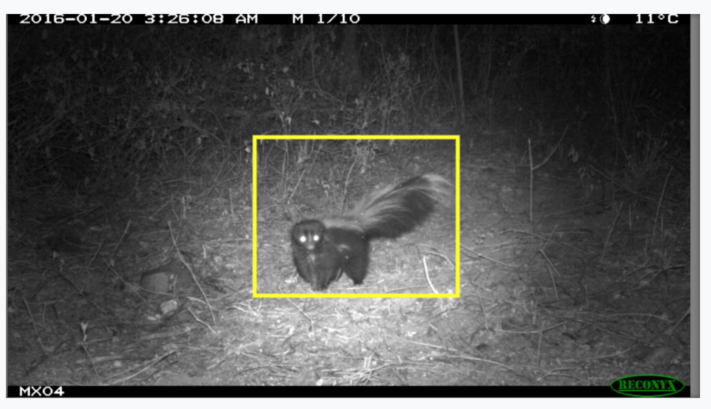

# Selia-annotator-devkit: *Development kit for Selia annotators*

This repository contains the basic code needed to develop a new annotator for [Selia/Irekua](https://github.com/CONABIO-audio/irekua).
An annotator is a tool to create and edit annotations over the representation of a file (images, spectrograms, video, etc...).
The annotation helps the user identify parts of the representation that are relevant or noteworthy, and when coupled with
a user given label the annotation can be used as inputs for machine learning algorithms.

Examples:
 
 1. Bounding box annotation
 2. Polygon annotation
 
The annotator is supposed to be stacked on top of a [visualizer](https://github.com/mbsantiago/selia-visualizer-devkit) so that
the user can see what is being annotated.



## Commands

### Quick start

To start development fork this repository and install with
```bash
npm install
```
or
```bash
yarn install
```

### Development tools

To start up a development server run
```bash
npm run start
```
The server will automatically reload on any changes to the source code.

### Build final version

To build a production version of your visualizer just run
```bash
npm run build
```
The compiled bundle will be stored in the `dist/` directory.

## Developing a new visualizer

### Code structure

This repository is structured as follows

    project
    │   README.md
    │   package.json
    |   webpack.config.js
    |   ...
    │
    └───src
    │   │   index.js
    │   │
    │   └─── annotator
    │       │   index.js
    │       │   ...
    │   
    └───public
        │   index.html
        └───files

The source directory (`src/`) should contain all the code relevant to the annotator. Any custom code should be placed within
the annotator directory (`src/annotator/`).

The public  directory (`public/`) contains a simple page for testing the developed annotator.

### Starting development

The annotator should be a single class that inherits from the class `AnnotatorBase` (within the package `@selia/annotator`)
and exported as default by the file `src/annotator/index.js`.

Hence any `src/annotator/index.js` file should have this structure:

```javascript
import AnnotatorBase from '@selia/annotator';

class MyAnnotator extends AnnotatorBase {
  // Custom code
  // ...
}

export default MyAnnotator
```

### Annotator basics

For full information on the annotator class check the corresponding [repository](https://github.com/mbsantiago/selia-annotator-base)
(Sorry no documentation for now, just the file with the base class).

The annotator has the following attributes. These are given at construction and should not be handled with care.

* `canvas`

    The canvas in which the object being visualized is displayed.
    
* `visualizer`

    The visualizer that is being used to represent the object that will be annotated.
    
* `annotation`

    The value of the current annotation if it exists.
    
* `edit`
 
    Boolean flag indicating wheter the annotator should respond to canvas events. If false the annotator
    should not be able to create or edit annotations.
    
* `phase`

    A description of the state or phase of the annotator. Currently, there are three phases available:

    * EMPTY_ANNOTATOR
    * EDITING
    * DONE
      
    The developer must change the phase of the annotator when relevant. To do this please use the `states`
    attribute like so:
    
      this.phase = this.states.EDITING

* `ctx`
 
  The '2d' [context](https://developer.mozilla.org/es/docs/Web/API/CanvasRenderingContext2D) of the canvas to use for drawing.


### Building an annotator

Any annotator must redefine the following methods:

#### `drawAnnotation(annotation)`

Method that draws an annotation in the canvas. The `annotation` argument is an object holding all the relevant information for
the annotation construction. BUT be careful!!!. The visualization of the object might change (for example by zooming in) and
the annotation drawing should change accordingly. Hence annotations are usually stored in "natural" coordinates (see the methods
`pointToCanvas` and `canvasToPoint` in the [visualizer code](https://github.com/mbsantiago/selia-visualizer-devkit)) and the
annotator must use the current visualizer state to translate the annotation to canvas coordinates. If this is confusing we hope
that the supplied example ([bounding box visualizer](https://github.com/mbsantiago/selia-bounding-box-annotator)) helps.

#### `drawEdit()`

Method that draws any partial annotation while its being created.

#### `init()`

Optional method. This method is run once on construction and should setup any variables that will be needed
at all times.

#### `getEvents()`

This method should return a mapping of canvas events to listeners that handle these events. For example

```javascript
getEvents() {
  return {
    mousemove: (event) => handleMouseMoveFunction(event),
    mouseup: (event) => handleMouseUpFunction(event)
  }
}
```

Whenever the developer decides that the annotation has been completed the component should translate any relevant position
information to "natural" coordinates using the current visualizer state and submit the annotation using the builtin method

    registerAnnotation(annotation)

## Example

To see a functioning example see [bounding box visualizer](https://github.com/mbsantiago/selia-bounding-box-annotator).
